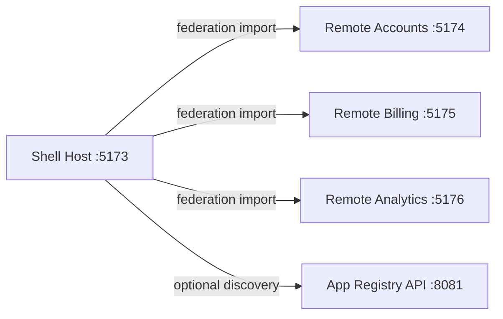
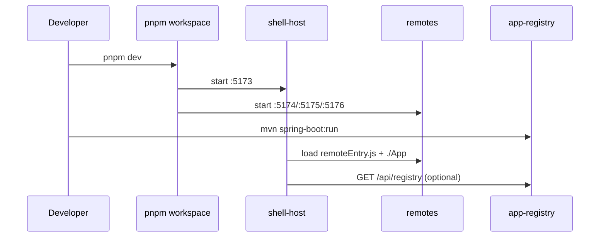

# mfe-platform

Monorepo for a local microfrontend platform with a React shell host, three React remotes, and a Spring Boot app registry.

## Stack

- Frontend apps: React 18 + TypeScript + Vite + Module Federation
- **Remotes Workflow:** Hybrid "build-watch + preview" to serve real `remoteEntry.js`
- Service: Spring Boot 3 (Java 17)
- Monorepo tooling: npm workspaces
- Infra: Docker Compose + local run scripts

## Repository Layout

```text
mfe-platform/
  apps/
    shell-host/
    remote-accounts/
    remote-billing/
    remote-analytics/
  services/
    app-registry/
  infra/
    docker-compose.yml
    scripts/
      start-local.ps1
      stop-local.ps1
      start-local.sh
```

## Architecture

- `shell-host` (port `5173`) dynamically loads remotes.
- `remote-accounts` (port `5174`) exposes `./App`.
- `remote-billing` (port `5175`) exposes `./App`.
- `remote-analytics` (port `5176`) exposes `./App`.
- `app-registry` (port `8081`) provides route/remote metadata at `/api/registry`.
- `shell-host` left nav and React Router routes are built from that runtime config.
- `shell-host` includes a debug page at `/debug/remotes` for loaded remotes, versions, and errors.

## Portfolio-grade Documentation

- Architecture decisions: [docs/architecture-decisions.md](docs/architecture-decisions.md)
- Security considerations: [docs/security-considerations.md](docs/security-considerations.md)
- Deployment and versioning strategy: [docs/deployment-versioning.md](docs/deployment-versioning.md)
- Heroku deployment guide: [docs/heroku-deployment.md](docs/heroku-deployment.md)

## Module Federation Contract

- Host and remotes use `@originjs/vite-plugin-federation`.
- Remotes expose both `./App` and `./routes`.
- Host remote URLs are resolved at runtime from the registry manifest (no hardcoded `remoteEntry` URLs in shell-host source).
- Shared dependencies are configured as singletons where supported:
  - `react`
  - `react-dom`
  - `react-router-dom`
  - `@mui/material`

This reduces duplicate runtime copies and helps prevent version skew in host/remote composition.

### Boundary Rules (No Circular Imports)

- Remotes must not import from `shell-host`.
- Remotes must not import from other remotes.
- Cross-app contracts belong in shared workspace packages (`@mfe/platform-contracts`, `@mfe/ui-kit`).
- Integration across app boundaries happens via runtime manifest + event contracts.

## Cross-app Event Bus

- Shared contract package: `@mfe/platform-contracts` in [packages/platform-contracts](packages/platform-contracts).
- Host registers a typed event bus and handles events centrally.
- Remotes publish events through the shared contract only (no direct host imports).

Supported event types:

- `NAVIGATE_TO_ACCOUNT` -> host performs centralized routing.
- `SHOW_TOAST` -> host displays notification/snackbar.
- `TRACK_EVENT` -> host handles centralized analytics logging.

## Safe Remote Version Bumps

When bumping a remote, follow this order:

1. Update the remote package version in `apps/remote-*/package.json`.
2. If shared deps change (`react`, `react-dom`, `react-router-dom`, `@mui/material`), bump them in **all** apps (host + remotes) to compatible ranges.
3. Keep `shared.requiredVersion` aligned in each app's `vite.config.ts`.
4. Update `version` in `services/app-registry` response for that remote.
  - Runtime remote URLs are configured via `app.registry.remotes.*` in `services/app-registry/src/main/resources/application.yml` (override by environment per stage).
5. Build all apps: `npm run build`.
6. Smoke test host navigation and `/debug/remotes`.

If a remote introduces breaking API changes, publish it under a new route/module contract and migrate host routing intentionally instead of in-place replacement.

Registry payload shape:

```json
{
  "platform": "mfe-platform",
  "routes": [
    {
      "id": "remote-accounts",
      "title": "Accounts",
      "path": "/accounts",
      "requiredRoles": ["USER", "ADMIN"],
      "remote": {
        "scope": "remote_accounts",
        "module": "./App",
        "stable": {
          "url": "http://localhost:5174/assets/remoteEntry.js",
          "version": "1.0.0-stable"
        },
        "canary": {
          "url": "http://localhost:5174/assets/remoteEntry.js",
          "version": "1.0.0-canary"
        },
        "rollout": {
          "canaryEnabled": false,
          "canaryPercentage": 0
        }
      }
    }
  ]
}
```

### Remote Version Strategy

- Host picks stable/canary per remote at runtime.
- Selection is deterministic per user using a userId hash and rollout percentage.
- If canary load fails, host falls back to stable and logs the incident.

### Canary Control (ADMIN)

- Shell-host page: `/admin/canary-control`.
- Registry APIs:
  - `GET /api/registry/admin/canary-flags`
  - `PUT /api/registry/admin/canary-flags/{remoteId}`

## Structured Logging and Telemetry

- Shell-host generates a session correlation ID at startup and a request correlation ID for each API request.
- Correlation headers sent to app-registry:
  - `X-Session-Id`
  - `X-Request-Id`
  - `X-Correlation-Id`
  - `X-User-Id`
- app-registry applies request correlation filtering and emits structured request logs.
- shell-host logs structured remote load attempts, durations, canary fallback incidents, and failures.

### Telemetry Endpoints

- Client ingest: `POST /api/telemetry`
  - Receives remote load failures and timing events from shell-host.
  - Stored in-memory in app-registry.
- Admin read: `GET /api/admin/telemetry` (ADMIN required)

### Telemetry Dashboard (ADMIN)

- Shell-host page: `/admin/telemetry`
- Displays in-memory telemetry records: event type, remote, level, duration, correlation ID, and message.

## Authentication and Authorization

- Mock login endpoint: `POST /api/auth/login` on app-registry.
- Local role mapping:
  - username `admin` => roles `ADMIN`, `USER`
  - any other username => role `USER`
- JWT contains `roles` claim and expiration.
- Shell stores the access token in memory only (no localStorage/sessionStorage persistence).
- Route access is enforced with `requiredRoles` from registry manifest.
- Left nav hides unauthorized routes based on current JWT roles.

### Refresh Strategy Note

Current local flow is intentionally simple and uses a single short-lived access token in memory.
For production, use short-lived access tokens plus refresh tokens in HttpOnly secure cookies,
with silent refresh and rotation to reduce token theft risk.

### Admin Endpoint Protection

- `GET /api/registry/admin/routes` requires `Authorization: Bearer <token>` and `ADMIN` role.
- app-registry validates JWT signature and expiry before serving admin endpoints.





## Local Run

### Prerequisites

- Node.js 20+
- npm 10+

For full Spring backend mode (optional):

- Java 17+
- Maven 3.9+

### Install Dependencies

```bash
cd mfe-platform
npm install
```

### Start Frontend Apps

```bash
npm run dev
```

This command starts:

- shell host on `http://localhost:5173`
- all remotes (accounts:5174, billing:5175, analytics:5176) in **watch mode**
  - Remotes auto-rebuild on change and expose `remoteEntry.js` via a static preview server.
- registry on `http://localhost:8081` (auto mode)

Auto mode behavior:

- if Maven is installed, starts real Spring app-registry (`services/app-registry`)
- if Maven is not installed, starts built-in mock registry

So the shell can always fetch route config/login/telemetry for demos with one command.

Registry mode overrides:

```bash
npm run dev:registry:real
npm run dev:registry:mock
```

Ports are fixed for reliable runtime loading:

- `5173` shell-host
- `5174` remote-accounts
- `5175` remote-billing
- `5176` remote-analytics
- `8081` mock app-registry

If startup fails with `port is already in use`, stop old local processes and rerun:

```powershell
./infra/scripts/stop-local.ps1
npm run dev
```

If you only want the frontend apps (no mock registry), run:

```bash
npm run dev:frontend
```

### Start App Registry

In another terminal:

```bash
cd services/app-registry
mvn spring-boot:run
```

Use this only when you want to demo/test against the real Spring service instead of the built-in mock.

### One-command start (Windows)

```powershell
./infra/scripts/start-local.ps1
```

### Stop local processes (Windows)

```powershell
./infra/scripts/stop-local.ps1
```

## Build

```bash
npm run build
```

### Optional: pnpm workspace mode

If you prefer `pnpm`, you can still run:

```bash
corepack prepare pnpm@9 --activate
pnpm install
pnpm -r --parallel dev
```

For Spring Boot packaging:

```bash
cd services/app-registry
mvn clean package
```

## Docker Compose (Registry only)

```bash
cd infra
docker compose up --build
```

Then open `http://localhost:8081/api/registry`.
